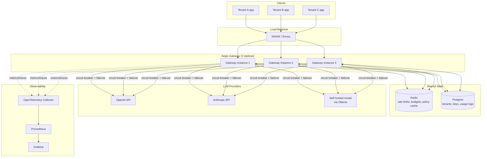
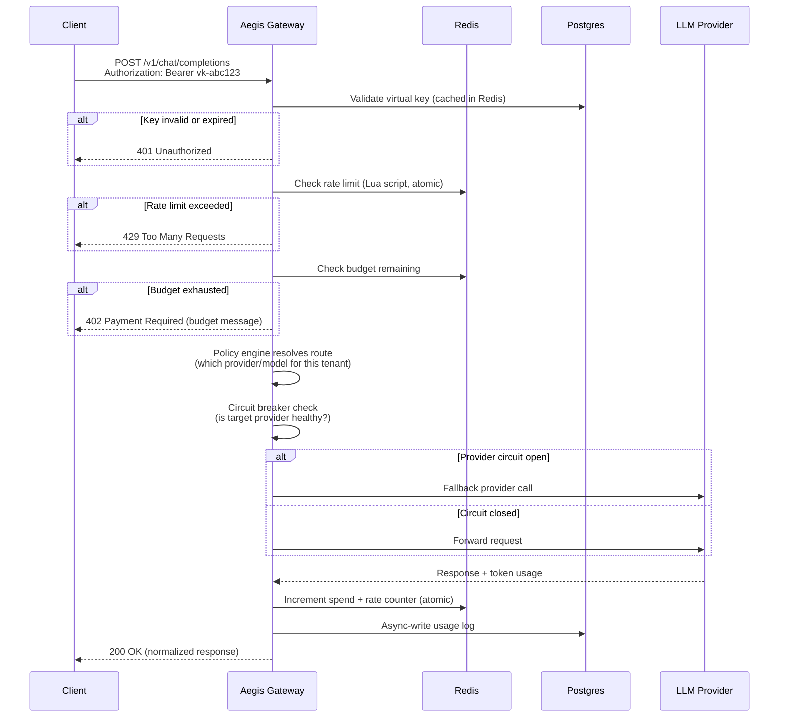

# Aegis — Self-Hosted Multi-Tenant AI Gateway
### Design Document / Build Plan

---

## 1. Problem Statement

Any team that calls more than one LLM provider (OpenAI, Anthropic, a self-hosted open model) runs into the same operational mess:

- Every provider has its own SDK, auth scheme, and error format — no consistency for the calling application.
- There's no central place to issue scoped credentials — anyone with the master OpenAI key can spend unlimited money.
- There's no per-team or per-user cost visibility until the bill arrives.
- There's no fallback when a provider has an outage — the app just fails.
- There's no consistent rate limiting across model providers with wildly different rate-limit rules.

This is why "AI Gateway" is now a standalone infrastructure category — companies buy or self-host tools like LiteLLM and Portkey specifically to solve this. **Aegis is a self-hosted, from-scratch implementation of that category**, scoped to what one engineer can build well in 30 days: a reverse proxy that fronts multiple LLM providers, issues scoped "virtual" API keys per tenant, enforces budgets and rate limits in real time, and stays up even when its own dependencies fail.

**One-line pitch for your README/resume:** *"A self-hosted AI gateway that lets you issue per-team API keys with independent token budgets, rate limits, and automatic provider failover — built from scratch in Go, without relying on an existing gateway library."*

That last clause matters. LiteLLM and Portkey exist and are good — you are not competing with them, you're proving you understand how they work internally by rebuilding the hard 20% yourself.

---

## 2. What "API key" means here

You'll implement two distinct kinds of keys, which is the actual design pattern real AI gateways use:

| Key type | Who holds it | Purpose |
|---|---|---|
| **Provider keys** | Only Aegis itself, stored encrypted at rest (Postgres + envelope encryption, or a `.env`/secrets manager for the MVP) | Your real OpenAI/Anthropic/self-hosted API keys. Never exposed to a client. |
| **Virtual keys** | Issued by Aegis to each tenant/team/user | The credential your "customers" actually use. Each one is scoped to: allowed models, a token/spend budget with a reset period (daily/monthly), a requests-per-minute limit, and an expiry. |

A client calls Aegis with a virtual key in the `Authorization` header exactly like they'd call OpenAI directly. Aegis validates the key, checks its budget and rate limit, decides which real provider key to use, forwards the request, meters the tokens used, and updates the spend counter — the client never sees or touches the real provider key. This virtual-key-with-budget pattern is exactly how LiteLLM and Portkey structure their systems, and it's the single most interview-defensible piece of this project because it forces you to reason about auth, quota enforcement, and atomicity together.

---

## 3. Scope: what Aegis does and does not do

**In scope (build this):**
- Reverse proxy in front of 2–3 real providers (OpenAI + Anthropic + optionally a self-hosted model via Ollama) exposed as one OpenAI-compatible endpoint
- Virtual key issuance and validation, scoped per tenant
- Redis + Lua-script token-bucket and sliding-window rate limiting, hand-rolled (not a library) — this is your proof of distributed-systems depth
- Budget enforcement: token-based spend tracking per key, hard block at 100%, soft warning at 80%
- Dynamic policy engine: routing rules and quotas hot-reloadable via an admin API, no restart needed
- Priority queueing under load (auth/critical traffic degrades last)
- Circuit breaker per provider + automatic failover (OpenAI down → retry on Anthropic) + in-memory fallback if Redis itself goes down
- 3 gateway replicas behind a load balancer, proving quota enforcement stays consistent across all of them via shared Redis state
- Observability: Prometheus + Grafana dashboards, OpenTelemetry tracing
- Load tests with k6/Locust, published p50/p95/p99 numbers, plus a chaos-test script that kills Redis mid-run

**Explicitly out of scope (don't chase these, they're what killed the 10-project version):**
- Semantic/embedding-based caching (Portkey-tier feature, needs its own eval — skip it)
- Multi-region deployment (you don't have the infra to prove it honestly — 3 replicas on one host proves the same distributed-consistency problem)
- A trained ML bot-detection model (that's TrafficIQ's job, and only if you build it with a real labeled dataset and honest eval)
- SSO/RBAC/enterprise auth (not relevant to a portfolio project)

---

## 4. High-Level Architecture



### Component responsibilities

- **Load balancer** — round-robins across gateway replicas. This is what makes the "3 replicas, consistent enforcement" claim real: if quotas were tracked per-instance in memory, a client could bypass limits just by hitting a different replica. Shared Redis state is what prevents that.
- **Gateway instance** (Go, stateless) — auth middleware → rate limiter → budget check → policy engine → circuit breaker → provider call → usage logging. Stateless by design so you can add/remove replicas freely.
- **Redis** — source of truth for anything that needs to be fast and shared: rate-limit counters (Lua scripts for atomic check-and-increment), cached policy rules (invalidated via pub/sub on update), circuit breaker state.
- **Postgres** — source of truth for anything that needs to be durable: tenants, virtual keys, budget definitions, historical usage logs for the cost dashboard.
- **Providers** — real upstream APIs, abstracted behind a common internal interface so adding a 4th provider is a config change, not a code change.

---

## 5. Request Flow (Sequence)



The two things in this flow you should be ready to explain in depth in an interview: **why the rate-limit and budget checks must be atomic Lua scripts** (race condition otherwise — two concurrent requests can both read "1 token left" and both proceed), and **why usage logging is async** (you don't want a slow Postgres write on the hot path of every LLM call).

---

## 6. Data Model (minimum viable)

```
tenants
  id, name, tier (free/pro/enterprise), created_at

virtual_keys
  id, tenant_id (FK), key_hash, allowed_models[],
  budget_usd, budget_period (daily/monthly), spend_usd,
  rpm_limit, expires_at, is_active

policies
  id, tenant_id (FK), rule_type (routing/quota/priority),
  rule_json, version, updated_at

usage_logs
  id, virtual_key_id (FK), provider, model,
  input_tokens, output_tokens, estimated_cost_usd,
  latency_ms, status_code, created_at
```

Store `key_hash`, never the raw key — same pattern as password storage. Only show the raw key once, at creation time.

---

## 7. Tech Stack

- **Language:** Go (this is the whole point of this project vs. your existing Python work — pick `net/http` + `chi` or `gin` for routing)
- **State:** Redis (rate limits, budgets, policy cache, circuit breaker state), Postgres (durable records)
- **Observability:** Prometheus + Grafana + OpenTelemetry
- **Load testing:** k6 or Locust
- **Deployment:** Docker Compose locally (gateway ×3, Redis, Postgres, Prometheus, Grafana, NGINX) — Kubernetes manifests as a stretch goal if time allows in week 4, since you already claim K8s on your resume and this would actually prove it

---

## 8. Build Plan

### Week 1 (Days 1–7) — MVP checkpoint — must be demo-able
- Day 1–2: Project scaffold, single-provider reverse proxy (just OpenAI), Docker Compose skeleton
- Day 3: Virtual key model in Postgres, key validation middleware
- Day 4–5: Redis + Lua sliding-window rate limiter (hand-rolled, not a library)
- Day 6: Basic budget tracking (spend counter, hard block)
- Day 7: Docker Compose end-to-end, basic tests, first README draft with a working demo GIF

**This is your fallback deliverable.** If the month gets cut short, this alone is a legitimate, demo-able resume project.

### Week 2 (Days 8–14) — Multi-tenant + policy engine
- Multi-provider support (add Anthropic, add self-hosted via Ollama)
- Dynamic policy engine: hot-reloadable routing/quota rules via admin API, propagated via Redis pub/sub
- Priority queueing (weighted fair queueing so critical traffic degrades last)
- Per-tenant tiering (Free/Pro/Enterprise quotas)

### Week 3 (Days 15–21) — Resilience + scale-out
- Circuit breaker per provider with automatic failover
- In-memory fallback rate limiting if Redis is unreachable
- Chaos-test script: kill Redis mid-run, prove the gateway degrades gracefully instead of failing open or crashing
- Scale to 3 replicas behind NGINX/Envoy, prove consistent quota enforcement across all three

### Week 4 (Days 22–30) — Observability + proof
- Prometheus + Grafana dashboards (requests/sec, latency percentiles, spend per tenant, circuit breaker state)
- OpenTelemetry tracing across the request path
- k6/Locust load test suite, publish real p50/p95/p99 latency numbers in the README, before and after the Redis chaos test
- Architecture diagram + README polish + short demo video/GIF
- Stretch: Kubernetes manifests, Helm chart

---

## 9. What makes this defensible in an interview

Be ready to answer, in depth, without notes:
1. Why Lua scripts specifically — what race condition do they prevent that a plain Redis `INCR` + check doesn't?
2. What happens to in-flight requests when you flip a policy rule mid-traffic — do you finish them under the old rule or the new one, and why?
3. Why 3 replicas prove a real distributed-systems property and what would actually change if this were truly multi-region (latency-based routing, data residency, eventual consistency of Redis replication)
4. What your circuit breaker's failure threshold and half-open retry logic are, and why you chose those numbers
5. What your load test numbers were before and after the chaos test, and what that tells you about your fallback path

If you can talk through those five without hesitation, this project will outperform generic clones by a wide margin — because almost no other fresher's project will have answers to any of them.

---

## 10. Resume bullet draft (once built)

> **Aegis — Self-Hosted Multi-Tenant AI Gateway** — Go, Redis, PostgreSQL, Docker
> Built a production-style AI gateway issuing scoped virtual API keys with per-tenant token budgets and rate limits, enforced atomically via hand-rolled Redis/Lua sliding-window limiters across 3 load-balanced replicas; implemented per-provider circuit breakers with automatic failover across OpenAI/Anthropic/self-hosted models, sustaining [X] req/s at p95 latency of [Y]ms under load testing, with graceful degradation proven via chaos testing against Redis failure.

Fill in X/Y once you have real numbers — never publish placeholder metrics.
