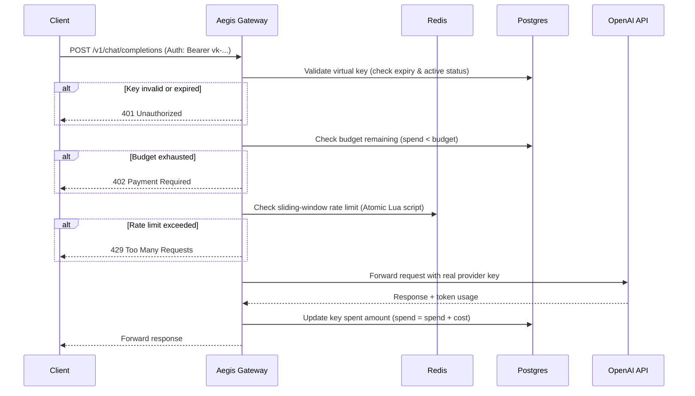

# Aegis — Self-Hosted Multi-Tenant AI Gateway

Aegis is a self-hosted, multi-tenant AI Gateway built from scratch in Go. It acts as a secure reverse proxy that fronts multiple LLM providers (starting with OpenAI), issuing scoped virtual API keys with independent token budgets, rate limits, and analytics tracking.

---

## 🚀 Key Features (Week 1 Deliverables)

*   **Secure API Authentication:** Exposes an OpenAI-compatible interface using "virtual API keys" (`vk-...`). These keys are stored as cryptographically secure SHA-256 hashes at rest in PostgreSQL—never in plain text.
*   **Atomic Sliding-Window Rate Limiting:** Enforces distributed rate limits (requests per minute) using a hand-rolled Redis Lua script. Running the sliding-window algorithm atomically inside Redis prevents race conditions (Check-Then-Act bugs) across multiple gateway replicas.
*   **Token Quota & Budget Enforcement:** 
    *   **Pre-Request Check:** Instantly blocks requests with `HTTP 402 Payment Required` if the key's USD budget is exhausted.
    *   **Post-Request Metering:** Intercepts response streams from LLM providers, parses token usage, calculates actual USD cost on-the-fly, and updates the tenant's spending in PostgreSQL.
*   **Self-Bootstrapping Containerized Setup:** Spins up the entire environment (Go gateway, Postgres DB, and Redis) locally with a single command. 

---

## 🛠️ Architecture Flow



---

## 💻 Tech Stack
*   **Language:** Go (`net/http`, `httputil.ReverseProxy`, Go Embed)
*   **Database:** PostgreSQL (with `github.com/lib/pq`)
*   **In-Memory Store:** Redis (with `github.com/redis/go-redis/v9`)
*   **Orchestration:** Docker, Docker Compose

---

## ⚙️ How to Setup & Run

### 1. Prerequisites
Make sure you have **Docker Desktop** installed and running on your system.

### 2. Configure Environment Variables
Copy the template file to `.env`:
```bash
cp .env.example .env
```
Open `.env` and fill in your actual credentials (especially `OPENAI_API_KEY`):
```env
OPENAI_API_KEY="sk-proj-YOUR_ACTUAL_KEY"
PORT=8080
```

### 3. Start the Services
Run Docker Compose to build the gateway and spin up the database clusters:
```bash
docker compose up --build
```
Once initialized, the gateway will create the tables, seed a default tenant, and print:
> `Proxy running on :8080`

---

## 🧪 Testing the Gateway

Once Aegis is running, you can test it from your terminal:

### 1. Authentication Check
*   **Invalid key:**
    ```bash
    curl -i -X POST http://localhost:8080/v1/chat/completions \
      -H "Authorization: Bearer vk-invalid" \
      -H "Content-Type: application/json" \
      -d '{"model": "gpt-4o-mini", "messages": [{"role": "user", "content": "Hi"}]}'
    ```
    *Result:* `HTTP/1.1 401 Unauthorized`

*   **Valid key (`vk-testkey123`):**
    ```bash
    curl -i -X POST http://localhost:8080/v1/chat/completions \
      -H "Authorization: Bearer vk-testkey123" \
      -H "Content-Type: application/json" \
      -d '{"model": "gpt-4o-mini", "messages": [{"role": "user", "content": "Hi"}]}'
    ```
    *Result:* Request is forwarded to OpenAI.

### 2. Rate Limiting Check (Limit: 5 requests / min)
Send 6 rapid requests. On the 6th request, you should receive:
*   *Result:* `HTTP/1.1 429 Too Many Requests` (`Too Many Requests: Rate Limit Exceeded`)

### 3. Budget Enforcer Check
If the key's spending (`spend_usd`) exceeds the allocated budget (`budget_usd`), Aegis will reject the request immediately:
*   *Result:* `HTTP/1.1 402 Payment Required` (`Payment Required: Budget limit exceeded`)
